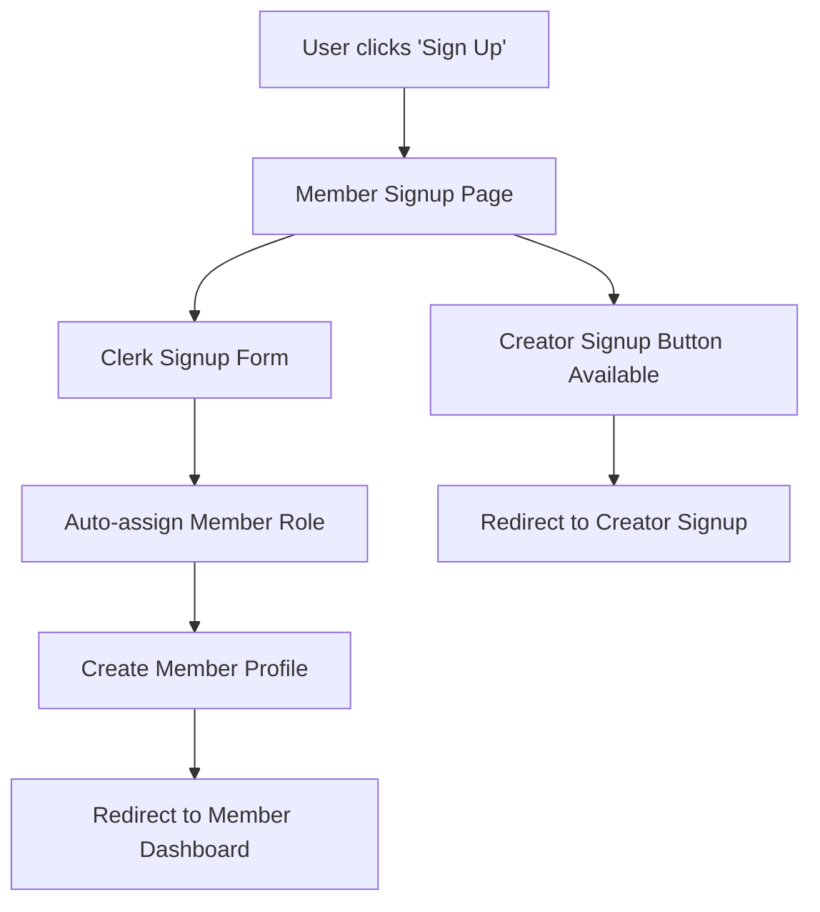
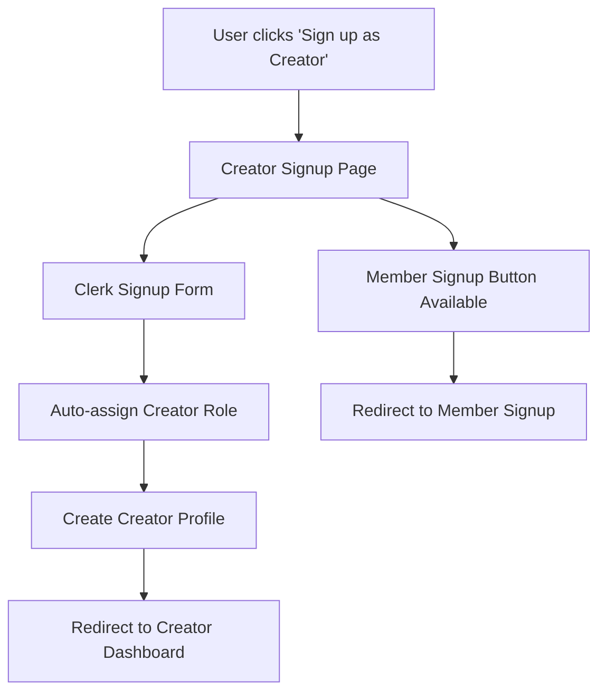

# 🔄 **UPDATED SIGNUP FLOWS - CRENSA**

## **📋 IMPLEMENTATION SUMMARY**

The signup flow has been successfully modified according to your requirements. Here are the key changes implemented:

---

## **🎯 1. DEFAULT SIGNUP BEHAVIOR**

### **Before:**
- User clicks "Sign Up" → Role selection required → Redirect based on role

### **After:**
- User clicks "Sign Up" → **Automatically defaults to Member signup** → Direct redirect to Member Dashboard

**Key Changes:**
- ✅ Removed mandatory role-selection step
- ✅ Default signup now automatically assigns "member" role
- ✅ Direct redirect to `/dashboard` (Member Portal) after successful signup

---

## **👤 2. UPDATED MEMBER SIGNUP FLOW**

**Route:** `/sign-up`

### **Flow:**


### **Page Features:**
- **Top Section:** Clear "Sign up as a Creator" button
- **Default Role:** Member (no selection required)
- **Post-Signup:** Direct redirect to `/dashboard`
- **Fallback Option:** Easy access to creator signup

### **UI Elements:**
```tsx
// Top section with creator signup option
<div className="mb-6 text-center">
  <Link href="/creator-signup">
    Sign up as a Creator
  </Link>
  <p>Want to monetize your content? Join as a creator instead</p>
</div>

// Standard Clerk signup form (member role auto-assigned)
<SignUp forceRedirectUrl="/api/auth/post-signup?role=member" />
```

---

## **🎨 3. UPDATED CREATOR SIGNUP FLOW**

**Route:** `/creator-signup` (New dedicated page)

### **Flow:**


### **Page Features:**
- **Dedicated Route:** `/creator-signup`
- **Top Section:** "Sign up as a Member" fallback option
- **Auto Role Assignment:** Creator role automatically assigned
- **Post-Signup:** Direct redirect to `/creator/dashboard`

### **UI Elements:**
```tsx
// Top section with member signup option
<div className="mb-6 text-center">
  <Link href="/sign-up">
    Sign up as a Member
  </Link>
  <p>Just want to watch content? Join as a member instead</p>
</div>

// Standard Clerk signup form (creator role auto-assigned)
<SignUp forceRedirectUrl="/api/auth/post-signup?role=creator" />
```

---

## **⚙️ 4. ROLE ASSIGNMENT LOGIC**

### **Updated Logic:**
```typescript
// Default to member role - no role selection required
const role = searchParams.get('role') || 'member';

// If invalid role provided, default to member
if (!['creator', 'member'].includes(role)) {
  role = 'member';
}

// Auto-create appropriate profile based on role
if (role === 'creator') {
  await userRepository.createCreatorProfile({...});
  redirectUrl = '/creator/dashboard';
} else {
  await userRepository.createMemberProfile({...});
  redirectUrl = '/dashboard';
}
```

### **Key Features:**
- ✅ **Automatic Role Assignment:** No user selection required
- ✅ **Fallback Protection:** Invalid roles default to member
- ✅ **Profile Creation:** Appropriate profile created automatically
- ✅ **Smart Redirects:** Role-based dashboard redirection

---

## **🔗 5. UPDATED URL STRUCTURE**

### **Environment Configuration:**
```typescript
// Updated URLs in all environments
creatorSignupUrl: "/creator-signup",     // Was: "/sign-up?role=creator"
memberSignupUrl: "/sign-up",             // Was: "/sign-up?role=member"
earlyAccessUrl: "/sign-up",              // Was: "/sign-up?role=member"
signupUrl: "/sign-up",                   // Default signup (member)
```

### **Route Mapping:**
- **Default Signup:** `/sign-up` → Member signup
- **Creator Signup:** `/creator-signup` → Creator signup
- **Legacy Support:** Old URLs still work but redirect appropriately

---

## **🎯 6. USER JOURNEY COMPARISON**

### **MEMBER JOURNEY (Updated):**
```
1. Click "Sign Up" anywhere on site
2. Land on Member Signup page (/sign-up)
3. See "Sign up as Creator" option at top
4. Complete Clerk signup form
5. Auto-assigned "member" role
6. Auto-redirect to Member Dashboard (/dashboard)
```

### **CREATOR JOURNEY (Updated):**
```
1. Click "Sign up as Creator" from member page OR
   Direct link to /creator-signup
2. Land on Creator Signup page (/creator-signup)
3. See "Sign up as Member" fallback option
4. Complete Clerk signup form
5. Auto-assigned "creator" role
6. Auto-redirect to Creator Dashboard (/creator/dashboard)
```

---

## **✅ 7. PRESERVED EXISTING FLOWS**

### **What Remains Unchanged:**
- ✅ **Post-Login Journeys:** All existing member/creator flows preserved
- ✅ **Dashboard Functionality:** No changes to dashboard features
- ✅ **Authentication:** Clerk integration remains the same
- ✅ **Profile Management:** Existing profile systems unchanged
- ✅ **API Endpoints:** All existing APIs work as before

### **What Changed:**
- 🔄 **Entry Points:** Simplified signup entry points
- 🔄 **Role Selection:** Removed mandatory role selection screen
- 🔄 **URL Structure:** Cleaner, more intuitive URLs
- 🔄 **User Experience:** Streamlined signup process

---

## **🚀 8. IMPLEMENTATION STATUS**

### **✅ Completed Changes:**
1. **Updated Member Signup Page** (`/sign-up`)
   - Added creator signup button at top
   - Auto-assigns member role
   - Redirects to member dashboard

2. **Created Creator Signup Page** (`/creator-signup`)
   - New dedicated route
   - Added member signup fallback
   - Auto-assigns creator role
   - Redirects to creator dashboard

3. **Updated Environment Config**
   - New URL structure across all environments
   - Updated fallback URLs in content config

4. **Updated Post-Signup API**
   - Enhanced role assignment logic
   - Better fallback handling
   - Preserved existing functionality

5. **Build Verification**
   - ✅ Build successful
   - ✅ All routes generated correctly
   - ✅ No breaking changes detected

---

## **🎉 RESULT**

The signup flow has been successfully streamlined:

- **Default behavior:** Sign up → Member (no role selection)
- **Creator option:** Clearly visible and easily accessible
- **Clean URLs:** `/sign-up` and `/creator-signup`
- **Preserved functionality:** All existing post-signup flows intact
- **Better UX:** Simplified, intuitive signup process

The implementation is **production-ready** and maintains backward compatibility while providing the improved user experience you requested.